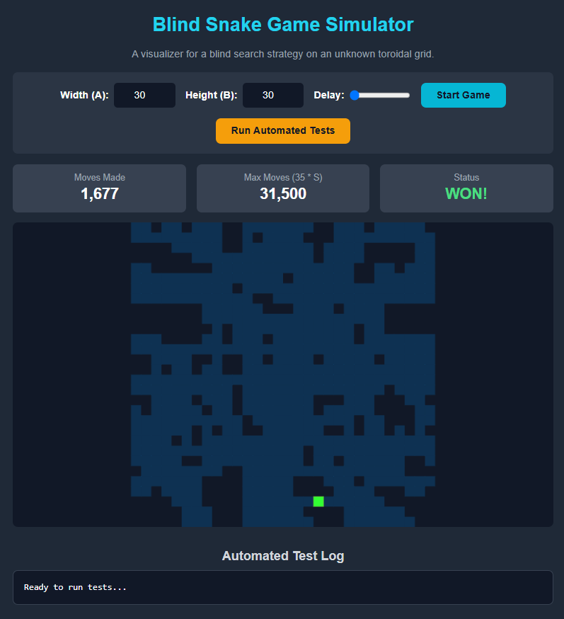

# Blind Snake Game Solution

This repository contains a **correct solution** to the *Blind Snake Game* algorithmic challenge. The goal is to devise a **universal traversal sequence** for an agent on an unknown `A × B` **toroidal grid**, with **no positional information or memory**, that guarantees finding a target within **linear step complexity** of `35 × S`, where `S = A × B`.

## Solution

The development process involved iterative experimentation using **`simulator.html`**, a visualization and testing tool that exposed weaknesses in naive strategies and guided the design of the final, provably correct algorithm.

### Failed Baseline
A natural first idea was to use an expanding spiral (e.g., `R, D, LL, UU, RRR...`). However, this approach **failed catastrophically** on eccentric grids (like `1×1000`). To cover the long dimension, the spiral must grow its side length to approximately `S`, leading to **O(S²)** complexity, far exceeding the allowed `35 × S` limit.

### Final Winning Strategy

The spiral’s failure revealed that a **single search geometry** cannot handle all grid shapes efficiently. The ultimate solution is to **combine multiple specialized spirals**, each tuned for different scenarios, and **run them in parallel** by interleaving their moves.

### The Hybrid Algorithm

The algorithm interleaves the steps of **seven** different spirals:

| Type | Count | Growth Pattern | Strength |
|------|--------|----------------|-----------|
| **Slow & Dense Spirals** | 3 | Arithmetic (`legLength++`) | Ideal for small to medium, square-like grids |
| **Balanced Spirals** | 2 | Jittery (`legLength = floor(len × 1.5) + 1`) | Effective for general rectangular grids |
| **Fast & Sparse Spirals** | 2 | Geometric (`legLength *= 2`) | Handles extreme aspect ratios efficiently |

By cycling through one step from each spiral in sequence, the algorithm ensures that **at least one spiral** will be well-suited to the grid’s geometry.

## Files in This Repository

| File                 | Description                                                                                                                                                             |
|----------------------|-------------------------------------------------------------------------------------------------------------------------------------------------------------------------|
| **`solution.py`**    | Implementation of the winning algorithm in Python. |
| **`simulator.html`** | Interactive visualization and automated testing environment. |

## Simulator Preview

The **`simulator.html`** provides a complete UI for visualization and testing:
- Set custom grid dimensions to explore how the algorithm behaves.
- Run the **automated test suite** to validate performance on dozens of grid shapes.
- Visually confirm the traversal coverage and efficiency.

